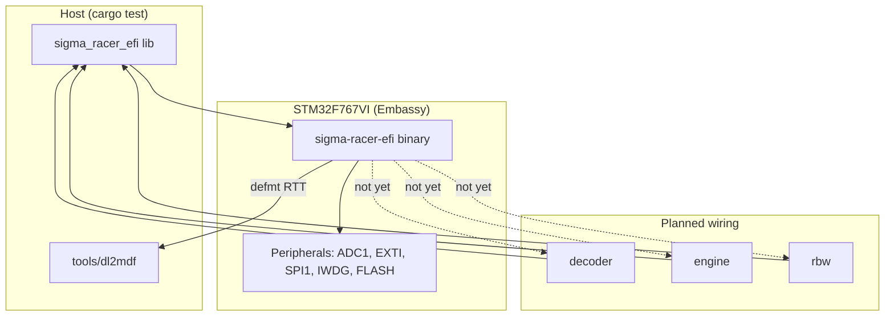
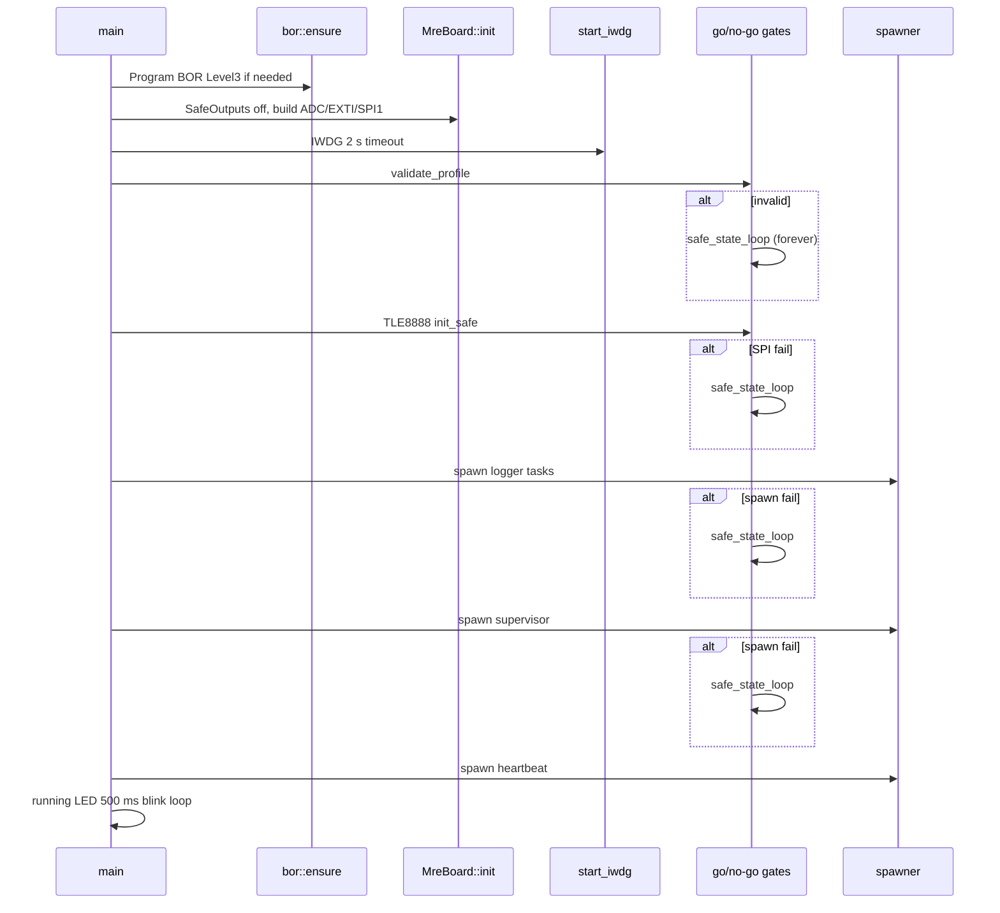
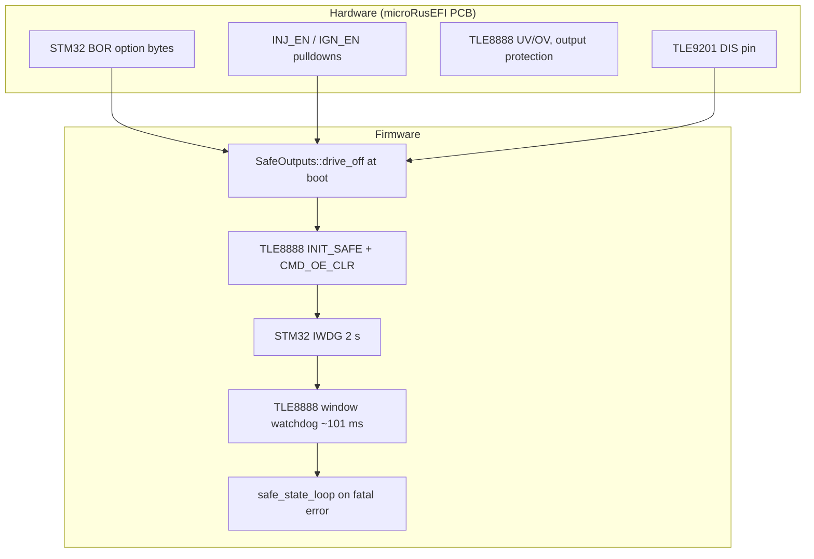

# Sigma Racer EFI — Architecture

Rust engine-control firmware for the [microRusEFI](https://www.shop.rusefi.com/shop/p/microrusefi-assembled-ecu-development-module) ECU (STM32F767VI), built on [Embassy](https://embassy.dev/). The design separates **board support** (pins, analog front-end, smart drivers) from **engine profiles** (cylinder count, firing order, trigger geometry) and keeps all control logic in a host-testable `#![no_std]` library.

**Current stage:** Phase 1 **characterization data logger** — analog sampling, crank/cam edge capture, defmt streaming. No fuel, ignition, CAN, or closed-loop control runs in firmware yet. A mature library layer (decoder, engine scheduling hooks, ride-by-wire safety monitor) exists and is covered by unit tests but is **not wired** into the binary.

**Related project:** [`sigma-racer-cluster`](../sigma-racer-cluster/) is the Wingman instrument cluster (`sigma-racer-cluster` on i.MX 8M Plus). It is a separate binary and codebase. This crate is the ECU firmware that would eventually talk to the bike over CAN.

---

## Design principles

1. **Engine-agnostic core** — `EngineProfile` and `EngineConfig` are compile-time selected via Cargo features. Board wiring (`BoardPins`, `defaults::wiring`) is independent of which engine is bolted on.
2. **Characterize, don't invent** — trigger wheel geometry, rev limits, and sensor calibrations marked ⚠ `[MEASURE]` are placeholders until read off the real engine in mule Phase 1. The stage-1 logger does not consume them; the decoder is designed to refuse running control until they are replaced.
3. **No sync = no spark** — `Decoder::spark_allowed()` gates ignition. Sync degrades immediately on pattern violations; noise edges are rejected without losing sync.
4. **Safety in layers** — hardware enables (pulldowns on INJ_EN/IGN_EN), TLE8888 safe init, MCU BOR + IWDG, TLE8888 window watchdog, and a latched safe-state loop. Ride-by-wire (`rbw`) adds an independent monitor when ETB is enabled.
5. **Host-testable logic** — everything that can run without peripherals lives in `src/lib.rs` modules with `#[cfg(test)]` blocks. Firmware tasks are thin Embassy wrappers.
6. **rusEFI lineage, clean license** — pin map and algorithms are ported from public microRusEFI documentation. rusEFI is GPL; this project reimplements behavior under **MIT OR Apache-2.0** without copying rusEFI source.

---

## High-level structure



### Crate artifacts

| Artifact | Path | Role |
|----------|------|------|
| Library | `src/lib.rs` → `sigma_racer_efi` | Shared `no_std` types and algorithms |
| Firmware | `src/bin/firmware.rs` → `sigma-racer-efi` | Embassy `main`, task spawner, LEDs |
| Tool | `tools/dl2mdf` | Parse `DL,*` logs → ASAM MDF4 |

### Cargo features

| Feature | Effect |
|---------|--------|
| `default` | Library only; no Embassy |
| `engine-yamaha-cp3` | `active_profile()` → Yamaha CP3 triple |
| `firmware` | Embassy, defmt, `stm32-metapac`, `bor`, `pins::embassy`, firmware binary |

Firmware builds **require both** `firmware` and an engine feature; otherwise `engines/mod.rs` emits `compile_error!`.

```bash
cargo build --features firmware,engine-yamaha-cp3 --release --target thumbv7em-none-eabihf
probe-rs run --chip STM32F767VI target/thumbv7em-none-eabihf/release/sigma-racer-efi
cargo test   # host, no features required
```

---

## Memory map and register references

The STM32F767VI memory layout and peripheral base addresses follow ST **RM0410** (STM32F76xxx/F77xxx). Cross-check against upstream Zephyr device tree:

| Region / peripheral | Base | Reference |
|---------------------|------|-----------|
| Internal flash | `0x08000000` (2048 KB) | Zephyr `stm32f767Xi.dtsi` |
| FLASH controller | `0x40023C00` | `stm32_metapac::FLASH`, `bor.rs` |
| DTCM | `0x20000000` (128 KB) | Zephyr `stm32f765.dtsi` |
| SRAM0 | `0x20020000` (384 KB) | Main RAM (Embassy `memory-x`) |
| IWDG | `0x40003000` | `tasks/safety.rs` |
| ADC1 | `0x40012000` | Sensor sweep |
| SPI1 | `0x40013000` | TLE8888 |
| EXTI | `0x40013C00` | Crank/cam capture |
| GPIO | `0x40020000` | Actuators, LEDs |
| RCC | `0x40023800` | 216 MHz PLL config |

Embassy generates the link script (`memory-x`, `single-bank` for 2 MB F767). Option-byte programming in `bor.rs` follows Zephyr `drivers/flash/flash_stm32f7x.c` → `flash_stm32_option_bytes_write()`.

---

## Boot sequence

Entry: `src/bin/firmware.rs::main`. Clock: HSI → PLL (÷8 ×216 ÷2) → **216 MHz** sysclk; APB1 ÷4, APB2 ÷2. Timestamps use Embassy time at **1 MHz** (`tick-hz-1_000_000`).



### Ordered steps

1. `BoardPins::mre_f7()`, `active_profile()`
2. `embassy_stm32::init(rcc_config())`
3. `bor::ensure()` — program brown-out reset to **Level 3** (~2.1 V) via flash option bytes if below target
4. `MreBoard::init(pins, p)` — all actuators driven off; returns `(board, tle8888_bus, iwdg)`
5. `tasks::safety::start_iwdg(iwdg)` — independent watchdog, **2 s** (`IWDG_TIMEOUT_US = 2_000_000`)
6. **Go/no-go** (failure → `safe_state_loop`, never returns):
   - `wiring::validate_profile(&profile)` — cylinder count ≤ 4, outputs exist
   - `init_or_log(&mut tle)` — TLE8888 SPI safe configuration
   - Logger task tokens: `sample`, `crank_capture`, `cam_capture`, `edge_logger`
   - `spawn_supervisor` — IWDG + TLE8888 WWD
7. Spawn tasks (see [Runtime tasks](#runtime-tasks))
8. `main` blinks **running** LED (PE4); `heartbeat` task blinks **comms** LED (PE2)

Boot logs `FIRMWARE_ID` (`sigma-racer-efi-mre`), `TARGET_MCU`, engine id, and warns that trigger geometry and rev limits are **unverified placeholders**.

---

## Safety architecture

Safety is layered from silicon through smart drivers to firmware supervision.



| Layer | Implementation | Constants / notes |
|-------|----------------|-------------------|
| **BOR** | `bor::ensure()` | `BorLevel::TARGET = Level3`; programs `OPTCR.BOR_LEV`; may reset on first program |
| **Safe GPIO** | `MreBoard::init` → `SafeOutputs::drive_off()` | Ignition PD1–PD4 low; INJ_EN PD11, IGN_EN PD10 low; ETB PWM/dir low; TLE9201 DIS PC8 low |
| **TLE8888 safe init** | `Tle8888Bus::init_safe()` | Soft reset, `INIT_SAFE` sequence, `CMD_OE_CLR`; enables stay low |
| **IWDG** | `start_iwdg` + `kick_iwdg()` | 2 s timeout; kicked in supervisor and `safe_state_loop` |
| **TLE8888 WWD** | `supervisor` task → `wwd_service()` | `WWD_PERIOD_MS = 101`; service every **~50.5 ms** |
| **Safe state** | `safe_state_loop()` | `drive_off()` + PE3 critical LED 120 ms blink + IWDG kick; infinite (`-> !`) |

**Safe-state triggers today:** invalid profile, TLE8888 init failure, logger spawn failure, supervisor spawn failure.

**Not yet in firmware:** `RbwMonitor` (ETB), `Decoder::spark_allowed` gating, rev-limit cuts, fuel/ignition disable on fault.

### TLE8888 SPI

- Bus: **SPI1** @ 1 MHz — SCK `PB3`, MOSI `PB5`, MISO `PB4`, CS `PD5` (active low)
- Command encoding: `src/tle8888.rs` (ported from rusEFI `tle8888.cpp` macros)
- `INIT_SAFE`: unlock, input/output config, VRS config, **`CMD_OE_CLR`** (outputs disabled)
- Window watchdog service: `CMD_WWDSERVICECMD` = `cmd_w(0x15, 0x03)`

INJ_EN and IGN_EN are **not** asserted during stage 1 — characterization only.

---

## Board and pin model

### Logical map (`src/pins.rs`)

`BoardPins::mre_f7()` is derived from rusEFI `board_configuration.cpp` and `connectors/main.yaml` for profile `meta-info-mre_f7.env`.

| Function | STM32 pin | Connector / note |
|----------|-----------|------------------|
| LED comms / running / warning / critical | PE2 / PE4 / PE1 / PE3 | On PCB |
| Ignition 1–4 | PD4, PD3, PD2, PD1 | Pins 9–12 (TC4427) |
| Trigger crank | PC6 | Pin 45 — VR/Hall via TLE8888 |
| Trigger cam | PA5 | Pin 25 — Hall |
| TLE8888 SPI | PB5 MOSI, PB4 MISO, PB3 SCK, PD5 CS | SPI1 |
| TLE8888 INJ_EN / IGN_EN | PD11 / PD10 | Active-high enables |
| ETB PWM / dir / disable | PC7 / PA8 / PC8 | TLE9201 |
| CAN TX / RX | PB6 / PB12 | Future tuning bus |
| microSD SPI2 | PB15/14/13, PE15 CS | v0.6.0+ |
| Console USART3 | PB10 TX, PB11 RX | J12/J13 |

### Embassy board (`src/pins/embassy.rs`)

`MreBoard::init` splits `embassy_stm32::Peripherals` once:

- **LEDs** — four status outputs
- **`SafeOutputs`** — ignition, enables, ETB (see [Safety](#safety-architecture))
- **`Adc` + `SensorChannels`** — vbatt PC1, clt PA0, iat PA1, tps_map PA4, an_volt1 PC0, an_volt2 PA6
- **`ExtiInput`** — crank PC6/EXTI6 (falling only), cam PA5/EXTI5 (any edge)
- **`Tle8888Bus`** — blocking SPI1

Panics if `pins != BoardPins::mre_f7()` — only one board revision is supported in firmware today.

### TLE8888 logical outputs (`TleOutput`)

| Output | rusEFI function | Connector |
|--------|-----------------|-----------|
| Injector1–4 | Injection drivers | Pins 37, 38, 41, 42 |
| GpOut1–4 | Fuel pump, radiator fan, aux | Pins 35, 34, 33, 43 |
| LowSide1–2 | VVT, idle IAC | Pins 7, 3 |

`defaults::wiring` maps cylinder index → injector + ignition pin and exposes aux constants (`FUEL_PUMP`, `VVT_SOLENOID`, etc.).

---

## Runtime tasks

Subsystem boundaries mirror rusEFI modules (`src/bin/tasks/mod.rs`).

| Task | File | Rate / behavior | Output |
|------|------|-----------------|--------|
| `sample` | `tasks/sensors.rs` | 100 Hz ADC sweep; log every 10th | `DL,S` @ 10 Hz; `LATEST` Watch |
| `crank_capture` | `tasks/trigger.rs` | EXTI falling on PC6 | `EDGES` channel |
| `cam_capture` | `tasks/trigger.rs` | EXTI any edge on PA5 | `EDGES` channel |
| `edge_logger` | `tasks/trigger.rs` | Drains `EDGES` (depth 128) | `DL,T`; `DL,X` on overflow |
| `supervisor` | `tasks/safety.rs` | ~50.5 ms | TLE WWD + IWDG kick |
| `heartbeat` | `firmware.rs` | 50 ms on, 2 s off | PE2 comms LED |
| `main` loop | `firmware.rs` | 500 ms on/off | PE4 running LED |

### Shared state

| Static | Type | Purpose |
|--------|------|---------|
| `tasks/sensors::LATEST` | `Watch<SensorFrame, 2>` | Latest scaled analog frame |
| `tasks/trigger::EDGES` | `Channel<EdgeEvent, 128>` | Edge queue crank + cam |
| `tasks/trigger::DROPPED` | `AtomicU32` | Overflow counter for `DL,X` |

### Planned tasks

- Trigger decode (input capture + `Decoder` FSM)
- Fuel injection via TLE8888
- Ignition coil charge/fire on PD1–PD4
- CAN (rusEFI-compatible or new protocol)
- ETB control + `RbwMonitor` tick
- SD logging (SPI2)

---

## Datalog protocol (Stage 1)

Records stream over **defmt → RTT** (`DEFMT_LOG=info`). Capture with `probe-rs run … | tee capture.log` and parse with `defmt-print` or `tools/dl2mdf`.

### `DL,S` — analog sensors

```text
DL,S,<t_us>,<vbatt_v>,<clt_c>,<iat_c>,<tps_map_v>,<an1_v>,<an2_v>
```

| Field | Source |
|-------|--------|
| `t_us` | `Instant::now().as_micros()` since boot |
| `vbatt_v` | `VBATT_SCALING` (rusEFI divider) |
| `clt_c`, `iat_c` | 2.7 kΩ NTC beta models |
| `tps_map_v`, `an1_v`, `an2_v` | Pin volts × `ANALOG_INPUT_DIVIDER` (1.68) |

Emitted at **10 Hz** from a **100 Hz** sweep (`SAMPLE_HZ = 100`, `LOG_EVERY = 10`).

### `DL,T` — trigger edges

```text
DL,T,<C|V>,<count>,<t_us>,<period_us>,<gap_ratio_x100>
```

| Field | Meaning |
|-------|---------|
| `C` / `V` | Crank / cam line |
| `count` | Edge index on that line |
| `period_us` | Time since previous edge on same line |
| `gap_ratio_x100` | This period ÷ previous period × 100 |

**Gap ratio interpretation (tooth-pattern discovery):**

| `gap_ratio_x100` | Typical meaning |
|------------------|-----------------|
| ~100 | Steady tooth-to-tooth |
| ~200 | Entering single missing-tooth gap |
| ~300 | Two missing teeth |
| ~50 | First tooth after a gap |

This is **characterization-grade** EXTI timing (executor jitter acceptable at cranking/idle). Engine control will replace it with input-capture + `Decoder`.

### `DL,X` — exceptions

```text
DL,X,dropped_edges,<n>
```

Emitted when the 128-deep `EDGES` channel overflows; counter reset after log.

### `dl2mdf` pipeline

`tools/dl2mdf` converts capture logs to **ASAM MDF4** with channel groups `sensors`, `trigger`, and optional `can` (from `candump -L`). Time bases are normalized to seconds relative to the first record in each stream.

---

## Library modules

### `datalog`

Host-testable scaling and interval math used by firmware tasks. `SensorFrame::from_sweep`, `EdgeIntervals::record`, `rpm_from_period_us`.

### `decoder`

Full crank/cam sync FSM: `Lost → Syncing → SyncCrank → SyncFull`.

- Missing-tooth detection from wheel geometry (`TriggerWheel { teeth, missing }`)
- `Decoder::spark_allowed()` — **no sync = no spark**
- Immediate desync on gap at wrong position, missed gap, or stall
- Noise rejection without losing sync
- **10 host tests** including acceleration, stall, 60-2 wheel

**Firmware status:** not imported in `src/bin/`. Trigger task uses raw `EdgeIntervals`, not `Decoder`.

### `engine`

`EngineState` — MAP, temperatures, VBatt, `TriggerState`, injection event counting.

- Cranking vs running discrimination (`CRANKING_RPM_THRESHOLD = 100`)
- Placeholder fuel scheduling (cranking simultaneous / sequential running)
- **6 host tests**

**Firmware status:** not used.

### `rbw`

Independent ride-by-wire **safety monitor** (`efi.md` §7) — deliberately separate from any throttle controller.

Checks (each → latched fail-safe):

1. **Range** — APP/TPS inside valid electrical window; open/short trips instantly
2. **Pair plausibility** — dual APP and dual TPS must agree after normalization (debounced)
3. **Tracking** — commanded vs actual plate position within envelope; stuck/runaway

Fail-safe is **latched**; recovery requires deliberate re-arm (zero demand + healthy sensors). **13 host tests** with full fault-injection matrix.

**Firmware status:** not used; ETB pins held safe only.

### `config` / `engines`

- `EngineConfig` — cylinders, firing sequence, injection/ignition modes
- `EngineProfile` — trigger setup, fire intervals, rev limits, validation
- `engine-yamaha-cp3` — Yamaha CP3 triple (MT-09, XSR900, R9)

### `timing`

`TriggerWheel`, `TriggerSetup`, `TriggerState`, `rpm_from_period_us`.

### `analog` / `sensors`

rusEFI-derived constants: `ADC_VREF = 3.3`, `VBATT_SCALING`, NTC models, `ANALOG_INPUT_DIVIDER = 1.68`.

### `tle8888`

Pure SPI command encoding: `INIT_SAFE`, watchdog constants, register helpers. Embassy driver in `pins/embassy/tle8888.rs`.

### `bor` / `safety`

`BorLevel` enum; option-byte programming via `stm32_metapac::FLASH` (firmware feature only).

---

## Engine profile: Yamaha CP3

Selected with `--features engine-yamaha-cp3`.

| Field | Value |
|-------|-------|
| ID | `"Yamaha CP3"` |
| Cylinders | 3, firing `INLINE_3_123` |
| Displacement | 890 cc |
| Injection | Sequential; cranking simultaneous |
| Ignition | Individual coils |
| Cycle | 720° four-stroke; fire intervals 240° × 3 |
| Target idle | 1200 RPM |
| Rev limits | soft 10,400 / hard 11,000 ⚠ placeholder |
| Trigger | 12-1 Hall crank + cam, `cam_required: true` ⚠ placeholder |

Firmware calls `wiring::validate_profile()` at boot (≤4 cylinders, outputs exist) but does **not** run the decoder or schedule events from this data yet.

### Adding an engine

1. Create `src/engines/your_engine.rs` with `pub fn profile() -> EngineProfile`
2. Add a Cargo feature `engine-your-engine`
3. Wire `active_profile()` in `engines/mod.rs`
4. Measure and replace all ⚠ `[MEASURE]` fields before enabling control stages

---

## Test strategy

### Host tests (`cargo test` — 62 tests in lib + dl2mdf)

| Module | Tests | Coverage |
|--------|-------|----------|
| `decoder` | 10 | Sync FSM, noise, stall, wheel variants |
| `rbw` | 13 | Fault matrix, latch, rearm, start permit |
| `datalog` | 7 | Scaling, gap ratios, RPM |
| `engine` | 6 | Injection modes, event counts |
| `config` / `engines` | 11 | Profile and firing validation |
| `pins` / `defaults` | 6 | MRE pin map vs rusEFI |
| `tle8888` | 3 | Command encoding |
| `sensors` / `analog` / `timing` / `safety` | 5 | NTC, VBatt, BOR target |
| `tools/dl2mdf` | 6 | Parse + MDF4 write |

### On-target only (no automated tests in repo)

- RCC / 216 MHz PLL bring-up
- BOR option-byte programming and reset behavior
- TLE8888 SPI init and WWD service
- EXTI capture jitter under executor load
- IWDG hardware timeout
- LED patterns and `safe_state_loop`
- defmt RTT throughput

---

## Roadmap (rusEFI parity)

Priority order for wiring library logic into firmware:

1. **Trigger** — input capture on PC6/PA5, feed `Decoder`, tooth scheduler
2. **TLE8888 control** — assert enables, drive injectors/low-sides under sync gate
3. **Fuel** — speed-density, VE tables, `EngineState` injection scheduling
4. **Ignition** — coil charge/fire on PD1–PD4 when `spark_allowed()`
5. **Sensors** — fold `LATEST` into `EngineState`; MAP from TPS/MAP channel
6. **CAN / USB** — tuning interface
7. **ETB** — TLE9201 + `RbwMonitor` at ~1 kHz
8. **Storage** — onboard SD (SPI2) for logs and tune persistence

### Integration points (where to wire next)

| Library API | Firmware hook |
|-------------|---------------|
| `Decoder::on_crank_edge` | Replace `EdgeIntervals` in `edge_logger` or new capture task |
| `Decoder::spark_allowed` | Ignition task gate |
| `EngineState` | Subscribe to `LATEST`, update each 100 Hz |
| `RbwMonitor::evaluate` | New ETB safety tick from `supervisor` or dedicated task |
| `Tle8888Bus` output commands | Fuel/ignition tasks after sync achieved |

---

## Build and deployment

| Item | Value |
|------|-------|
| Toolchain | Rust 1.92.0 (`rust-toolchain.toml`) |
| Target | `thumbv7em-none-eabihf` |
| Runner | `probe-rs run --chip STM32F767VI` (`.cargo/config.toml`) |
| Link | `build.rs` adds `--nmagic`, `-Tlink.x`, `-Tdefmt.x` for thumb |
| Release | `lto = thin`, `panic = abort`, `strip = true`, `debug = 2` |

### Key constants

```text
FIRMWARE_ID              = "sigma-racer-efi-mre"
TARGET_MCU               = "STM32F767VI"
SAMPLE_HZ                = 100
LOG_EVERY                = 10        → DL,S at 10 Hz
WWD_PERIOD_MS            = 101
IWDG_TIMEOUT_US          = 2_000_000 → 2 s
BorLevel::TARGET         = Level3 (~2.1 V)
ADC_VREF                 = 3.3
ANALOG_INPUT_DIVIDER     = 1.68
CRANKING_RPM_THRESHOLD   = 100.0
CRANKING_INJECTION_MS    = 3.0
MAX_CYLINDERS            = 4
```

---

## References

- [microRusEFI hardware](https://github.com/rusefi/hw_microRusEfi)
- [rusEFI repository](https://github.com/rusefi/rusefi)
- [rusEFI microRusEFI wiring wiki](https://wiki.rusefi.com/Hardware-microRusEfi-wiring)
- [Embassy STM32F767](https://docs.embassy.dev/embassy-stm32/git/stm32f767vi/index.html)
- ST RM0410 — STM32F76xxx/F77xxx reference manual
- Zephyr `dts/arm/st/f7/stm32f7.dtsi`, `stm32f767Xi.dtsi` — peripheral base addresses
- Zephyr `drivers/flash/flash_stm32f7x.c` — option-byte write pattern
